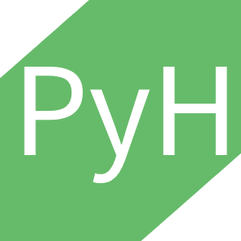
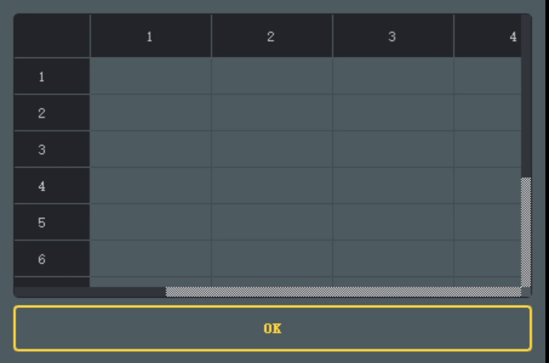
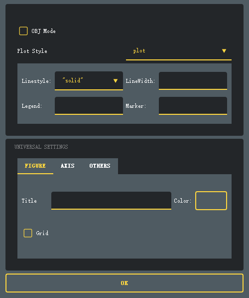
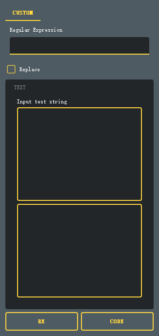
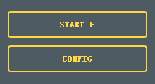

# PyHelper

PyHelper is an open-source instrument which is intended to help Python users to write codes more conveniently and more efficiently, to write the intricate plotting setting codes with a neat GUI interface, for example.

The project is just at the beginning and is in the ongoing development, so contact me if you want to contribute to it or you have any idea of new features you want to add to PyHelper.

Since I'm an undergraduate student, it must be a long process to develop the program. So your contribution is of great importance!





## Contents

[1.Installation](#1.Installation)

[2.Features](#2,Features)

[	2.1 Pyplot](#2.1PyPlot)

[		2.1.1 Subplots](#2.1.1 SubPlots)

[		2.1.2 Plot Setting](#2.1.2 Plot Setting)

[3. Structure of Codes](#3. Structure of Codes)


## 1.Installation

### Requirements

Python 3.6 +


**Packages**

1. PySide6
2. pyperclip
3. numpy
4. qt_material


### Installation (Windows)

**Step1**

We recommend using a virtual environment, such as [venv](https://docs.python.org/3/library/venv.html) , [virtualenv](https://virtualenv.pypa.io/en/latest), or conda (preferred).

```bash
# create virtual environment
conda create -n your_env_name python=3.7

# activate the environment
activate your_env_name

# upgrade pip
python -m pip install --upgrade pip

# instal pagckages
pip install pyside6, pyperclip, qt_materail, numpy, keyboard

```


**Step2**

Download "PyHelper.zip", and unzip it.


**Step3** 

Run file in different ways

- run "Pyhelper.py" in Python directly
- Edit PyHelper.bat and replace "qt" with your_env_name, and run the **shortcut** "PyHelper"


## 2.Features

### 2.1 PyPlot

"PyPlot" is  a module intended for python plotting, especially for **"matplotlib"** package.

#### 2.1.1 SubPlots

"Subplots" can create codes to layout your subgraphs using "GridSpec" , according to the figures on the table. See following examples.


See the example in [matpotlib gallary](https://matplotlib.org/stable/gallery/subplots_axes_and_figures/gridspec_multicolumn.html#sphx-glr-gallery-subplots-axes-and-figures-gridspec-multicolumn-py). In order to generate codes of grid layout,  we can use the "SubPlots" function.




After pressing "OK" button, we get the following codes in our **clipboard**.


```python
import matplotlib.pyplot as plt
import numpy as np
import matplotlib.gridspec as gridspec

fig = plt.figure(tight_layout=True,
        #wsapce = , hspace = ,
        )
#fig.suptitle('title')

gs = gridspec.GridSpec(3, 3,figure=fig)
ax1 = fig.add_subplot(gs[0:1, 0:3])
ax2 = fig.add_subplot(gs[1:2, 0:2])
ax3 = fig.add_subplot(gs[1:3, 2:3])
ax4 = fig.add_subplot(gs[2:3, 0:1])
ax5 = fig.add_subplot(gs[2:3, 1:2])

```


#### 2.1.2 Plot Setting

"Plot setting" helps us complete the figure settings with a GUI interface. Here is the list of all the settings.



1. Obj Mode: 

   Choose whether there is an "ax" object. If Obj mode is off, all the settings will begin with "plt." , otherwise they will start with the name of the object

>Note: some of codes in different modes are different. 
>
>Eg: set xlabel
>
>Obj Mode: obj.set_xlabel("xlabel")
>
>otherwise: plt.xlabel("xlabel")


2. Plot Style

   plot/scatter

   **plot:**

   1. Linestyle
   2. Linewidth
   3. Legend
   4. Marker

   **scatter:**

   1. s
   2. Marker
   3. Alpha
   4. Legend
   5. Cmap
   6. Edgecolor
   7. Linewidth

   

3. Universal Settings
   1. Figure
      1. Title
      2. Color (of the data)
      3. Grid
         1. Linestyle
         2. Linewidth
         3. Color (of the grid line)
   2. Axis
      1. Hide X: judge whether to hide x axis
      2. xlabel
      3. xtick
      4. Hide Y:judge whether to hide y axis
      5. ylabel
      6. ytick
   3. Others 
      1. Save file path
      2. dpi


### 2.2 Re

"Re" gathers instruments concerned with **Regular Expressions**.

#### 2.2.1 Match

"Match" can test your regular expression by applying the expression to the input text and then show the matched text or the replaced text if "replace mode" is chosen.




### 2.3 Latex

"Latex" is a collection of instruments concerned with latex.

#### 2.3.1 Hotkey

Similar with "Plot Setting", "Hotkey" is intended to help writing latex codes more conveniently. By using **keyboard** package, we can define global hotkeys on our own. See more [here](https://github.com/boppreh/keyboard).

> Actually, you can directly run "Instruments\Hotkey.py" if you don't want to run the whole program



1. Start ▶/ Stop ■

   To start or stop the process.

2. Config

   To open the "Instruments/Hotkey.py" and you can modify or create the hotkeys here.

## 3. Structure of Codes

In this section, we will show the structure of key files, which is especially intended for our (potential) developers.

```bash
PyHelper:.
│  PyHelper.bat
│  PyHelper.lnk						#shortcut
│  PyHelper.py
│  PyHelper.vbs
│  README.md
│  
├─Instruments
│  │  Hotkey.bat
│  │  Hotkey.py
│  │  Subplots.py					
│  │  __init__.py
│  │  
│  ├─Icon
│  │      favicon_io.zip
│  │      ghelpericon.zip
│  │      pyhelper.ico
│  │      pyhelper.png
│  │      
│  ├─MyWidgets						# Widgets defined by ourselves
│  │    MyWidgets.py
│  │    __init__.py
│  │          
│  ├─Readmefigures
│        Hotkey.png
│        Match.png
│        PlotSetting.png
│        Subplots.gif
│        
│          
└─Windows	
    │  Mainwindow.py				# Main window
    │  
    ├─SubSubwindows
    │  │  AbstractSubSubwindow.py
    │  │  __init__.py
    │  │  
    │  ├─Latex						#SubSubs of Latex
    │  │    Hotkeywindow.py
    │  │    Latex.py				#!Interface of Latex SubSubwindow
    │  │    __ini__.py
    │  │          
    │  ├─Pyplot						#SubSubs of Pyplot
    │  │    PlotSetwindow.py		
    │  │    Pyplot.py				#!Interface of PyPlot SubSubwindow
    │  │    Subplotswindow.py
    │  │    __init__.py
    │  │          
    │  ├─Re							#SubSubs of Re
    │      Matchwindow.py
    │      Re.py					#!Interface of Re SubSubwindow
    │      __init__.py
    │      
    │          
    ├─Subwindows
        AbstractSubwindow.py
        Latexwindow.py
        Pyplotwindow.py
        Rewindow.py
        Subwindows.py				#!Interface of Subwindows
        __init__.py

```

